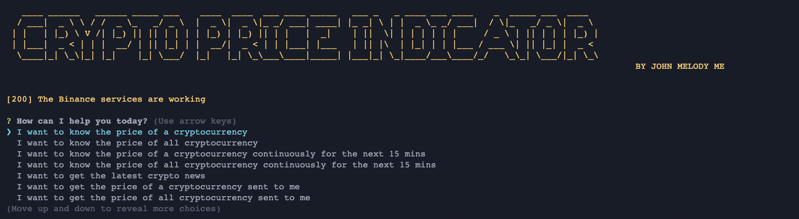

## Crypto Price Indicator

#### License

```
MIT License

Copyright (c) 2022 John Melody Me

Permission is hereby granted, free of charge, to any person obtaining a copy
of this software and associated documentation files (the "Software"), to deal
in the Software without restriction, including without limitation the rights
to use, copy, modify, merge, publish, distribute, sublicense, and/or sell
copies of the Software, and to permit persons to whom the Software is
furnished to do so, subject to the following conditions:

The above copyright notice and this permission notice shall be included in all
copies or substantial portions of the Software.

THE SOFTWARE IS PROVIDED "AS IS", WITHOUT WARRANTY OF ANY KIND, EXPRESS OR
IMPLIED, INCLUDING BUT NOT LIMITED TO THE WARRANTIES OF MERCHANTABILITY,
FITNESS FOR A PARTICULAR PURPOSE AND NONINFRINGEMENT. IN NO EVENT SHALL THE
AUTHORS OR COPYRIGHT HOLDERS BE LIABLE FOR ANY CLAIM, DAMAGES OR OTHER
LIABILITY, WHETHER IN AN ACTION OF CONTRACT, TORT OR OTHERWISE, ARISING FROM,
OUT OF OR IN CONNECTION WITH THE SOFTWARE OR THE USE OR OTHER DEALINGS IN THE
SOFTWARE.
```

**加密货币指标工具：揭示洞察，做出明智选择**

隆重推介我们的尖端加密货币指标工具 - 您在解读复杂的加密货币交易世界时的终极伙伴。借助实时数据分析和关键指标，赋予自己揭示市场趋势、价格变动和潜在机会的能力。无论您是经验丰富的交易员还是好奇的投资者，我们的工具为您提供知识，以应对波动的加密货币领域并做出明智的决策。在加密货币领域保持领先，尽在加密货币指标工具。

#### Screenshot



#### Demo


#### Configuration

In order for this application to work, you required to setup an environment.
Create a file named `.env`, with the variables ar follow:

```
BINANCE_API_KEY=XXXXXXXXXXXXXXXXXXXXXXXXXXXXXXXXXXXXXXXXXXXXXXX
BINANCE_API_SECRET=XXXXXXXXXXXXXXXXXXXXXXXXXXXXXXXXXXXXXXXXXXXX
TELEGRAM_TOKEN=XXXXXXXXXXXXXXXXXXXXXXXXXXXXXXXXXXXXXXXXXXXXXXXX
DISCORD_WEBHOOK_APP_NAME=XXXXXXXXXXXXXXXXXXXXXXXXXXXXXXXXXXXXXX
DISCORD_WEBHOOK_URL=XXXXXXXXXXXXXXXXXXXXXXXXXXXXXXXXXXXXXXXXXXX
GREEN_API_TOKEN=XXXXXXXXXXXXXXXXXXXXXXXXXXXXXXXXXXXXXXXXXXXXXXX
GREEN_ID_INSTANCE=XXXXXXXXXXXXXXXXXXXXXXXXXXXXXXXXXXXXXXXXXXXXX
GMAIL_ADDRESS=XXXXXXXXXXXXXXXXXXXXXXXXXXXXXXXXXXXXXXXXXXXXXXXXX
GMAIL_PASSWORD=XXXXXXXXXXXXXXXXXXXXXXXXXXXXXXXXXXXXXXXXXXXXXXXX
NEWS_API=XXXXXXXXXXXXXXXXXXXXXXXXXXXXXXXXXXXXXXXXXXXXXXXXXXXXXX

```

#### Where to get the APIKEY amd API SECRET?

Visit https://www.binance.com/


#### Where to get Discord Webhook Url?


#### Where to get Green API?

Visit https://green-api.com

#### Where to get NewsAPI?

Visit http://newsApi.org

#### Installation

```
npm install
```

#### Execution

```
npm start
```

#### Testing

```
npm test
```

#### Integration

1. Telegram

Create Bot for your group.


then add the bot to your group.


### Support Me

<div class="column">
    <a href="https://www.huobi.com/en-us/v/register/double-invite/?invite_code=rjvc6223&inviter_id=11343840">
        
    </a>
    <br>
    <a href="https://shop.ledger.com/?r=a240cf0a4c37">
        
    </a>
    
</div>


### 个人捐赠支持
如果您认为该项目对您有所帮助，并且愿意个人捐赠以支持其持续发展和维护，🥰我非常感激您的慷慨。
您的捐赠将帮助我继续改进和添加新功能到该项目中。 通过财务捐赠，您将有助于确保该项目保持免
费和对所有人开放。即使是一小笔捐款也能产生巨大的影响，也是对我个人的鼓励。

以下是我的支付宝二维码，您可以扫描二维码进行个人捐赠：

<br />
<div style="display: flex; justify-content: space-between; margin-bottom: 20px;">
  
 
  
</div>


[](https://ko-fi.com/F1F5VCZJU)


## 爱心捐款
<a href="https://qr.alipay.com/fkx19369scgxdrkv8mxso92"></a> <a href="https://ko-fi.com/F1F5VCZJU"></a> <a href="https://www.paypal.com/paypalme/ctkqiang"></a> <a href="https://donate.stripe.com/00gg2nefu6TK1LqeUY"></a>

## 关注我
<a href="https://twitch.tv/ctkqiang"></a> <a href="https://open.spotify.com/user/22sblyn4dsymya3xinw3umhai"></a> <a href="https://www.tiktok.com/@ctkqiang"></a> <a href="https://stackoverflow.com/users/10758321/%e9%92%9f%e6%99%ba%e5%bc%ba"></a> <a href="https://www.facebook.com/JohnMelodyme/"></a> <a href="https://github.com/ctkqiang"></a> <a href="https://www.instagram.com/ctkqiang"></a> <a href="https://www.linkedin.com/in/ctkqiang/"></a> <a href="https://linktr.ee/ctkqiang.official"></a> <a href="https://github.com/ctkqiang/ctkqiang/blob/main/assets/IMG_9245.JPG?raw=true"></a>


